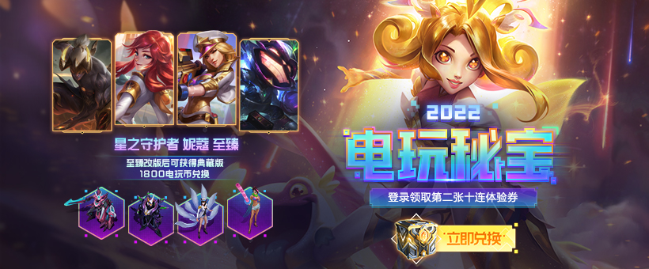
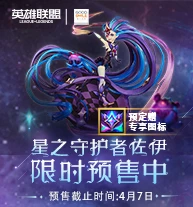
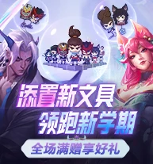
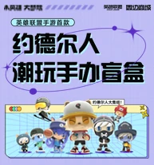
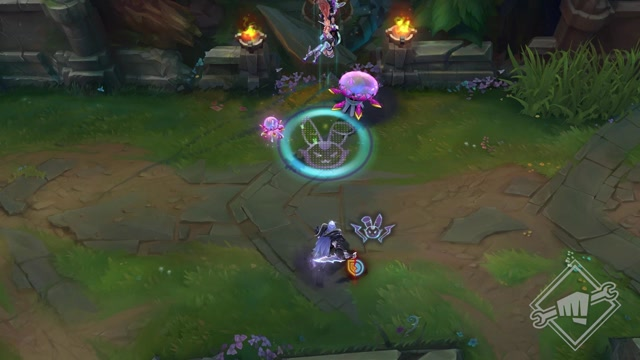

<!DOCTYPE html>
<html lang="en">

<head>
	<meta charset="UTF-8">
	<meta http-equiv="X-UA-Compatible" content="IE=edge">
	<meta name="viewport" content="width=device-width, initial-scale=1.0">
	<title>英雄联盟</title>
	<link rel="stylesheet" type="text/css" href="css/style.css" />
	<link rel="stylesheet" type="text/css" href="css/loader.css">
	
</head>

<body>
	

		

			

				
				<ul class="head-nav">
					<li>
						<a href="#">
							
								游戏资料
							
							GAME INFO
						</a>
					</li>
					<li>
						<a href="#">
							
								商城/合作
							
							STORE
						</a>
					</li>
					<li>
						<a href="#">
							
								社区互动
							
							COMMUNITY
						</a>
					</li>
					<li>
						<a href="#">
							
								赛事官网
							
							ESPORTS
						</a>
					</li>
					<li>
						<a href="#">
							
								自助系统
							
							SYSTEM
						</a>
					</li>
				</ul>
				

					

						
						
					

				

				
					
				
				<a href="#" class="head-icon">
					
				</a>
	
				

					

						<ul class="header-ul-tit">
							<li class="header-li-title">
								<a class="head-nav-sub-a" href="#">游戏下载</a>
								<a class="head-nav-sub-a" href="#">新手指引</a>
								<a class="head-nav-sub-a" href="#">资料库</a>
								<a class="head-nav-sub-a" href="#">开发者基地</a>
								<a class="head-nav-sub-a" href="#">海克斯战利品库</a>
							</li>
							<li class="header-li-title">
								<a class="head-nav-sub-a" href="#">点券充值</a>
								<a class="head-nav-sub-a" href="#">道聚城</a>
								<a class="head-nav-sub-a" href="#">周边商城</a>
								<a class="head-nav-sub-a" href="#">LOL桌游</a>
								<a class="head-nav-sub-a" href="#">网吧特权</a>
							</li>
							<li class="header-li-title">
								<a class="head-nav-sub-a" href="#">视频中心</a>
								<a class="head-nav-sub-a" href="#">官方微信</a>
								<a class="head-nav-sub-a" href="#">官方微博</a>
								<a class="head-nav-sub-a" href="#">玩家创作馆</a>
								<a class="head-nav-sub-a" href="#">玩家服务</a>
							</li>
							<li class="header-li-title">
								<a class="head-nav-sub-a" href="#">LPL职业联赛</a>
								<a class="head-nav-sub-a" href="#">LDL发展联赛</a>
								<a class="head-nav-sub-a" href="#">全球总决赛</a>
								<a class="head-nav-sub-a" href="#">城市英雄争霸赛</a>
								<a class="head-nav-sub-a" href="#">全明星赛</a>
							</li>
							<li class="header-li-title">
								<a class="head-nav-sub-a" href="#">图标自助领取</a>
								<a class="head-nav-sub-a" href="#">转区系统</a>
								<a class="head-nav-sub-a" href="#">账号查询</a>
								<a class="head-nav-sub-a" href="#">信誉分系统</a>
								<a class="head-nav-sub-a" href="#">服务器状态查询</a>
							</li>
						</ul>
					

				

			

	
	
		

		

			
			

		

		

			

				

					<ul class="promo-list">
						<li class="promo-item">
							
						</li>
					</ul>
				

				

					

						

							综合
							公告
							赛事
							攻略
							社区
						

					

					

						<ul class="icon-list-ul">
							<li class="icon-list-ul-title">
								视频
								<a href="#" class="item-icon">
									【云顶之弈】TOC3 云顶之弈公开赛参赛指南
								</a>
							</li>
							<li class="icon-list-ul-title">
								视频
								<a href="#" class="item-icon">
									【云顶之弈】TOC3 云顶之弈公开赛参赛指南
								</a>
							</li>
							<li class="icon-list-ul-title">
								视频
								<a href="#" class="item-icon">
									【云顶之弈】TOC3 云顶之弈公开赛参赛指南
								</a>
							</li>
							<li class="icon-list-ul-title">
								视频
								<a href="#" class="item-icon">
									【云顶之弈】TOC3 云顶之弈公开赛参赛指南
								</a>
							</li>
							<li class="icon-list-ul-title">
								视频
								<a href="#" class="item-icon">
									【云顶之弈】TOC3 云顶之弈公开赛参赛指南
								</a>
							</li>
							<li class="icon-list-ul-title">
								视频
								<a href="#" class="item-icon">
									【云顶之弈】TOC3 云顶之弈公开赛参赛指南
								</a>
							</li>
						</ul>
					

				

				

					

						
							<h2>热门活动</h2>
						
						

							正在进行
							商城特惠
							长期活动
						

					

					

						<ul class="act-Container">
							<li class="act-item">
								
								
联名雕塑 限时预售中

								<a href="#" class="overtime">长期活动</a>
							</li>
							<li class="act-item">
								
								
神话级小小英雄

								<a href="#" class="overtime">长期活动</a>
							</li>
							<li class="act-item">
								
								
英雄联盟排位FAQ

								<a href="#" class="overtime">长期活动</a>
							</li>
							<li class="act-item">
								
								
EDG夺冠纪念图标表情领取

								<a href="#" class="overtime">长期活动</a>
							</li>
						</ul>
					

				

	
				

					

						

							<a target="_block" href="https://lol.qq.com/download.shtml?ADTAG=lolweb.v3">
								<video class="m-mvvm-video" autoplay="" loop="" src="images/btn-download.mp4">
									<source src="images/btn-download.mp4">
								</video>
							</a>
							

								新手必备
							

							

								<a href="#" class="btn-href">
									领取中心
								</a>
							

							

								<a href="#" class="btn-href-i">
									在线客服
								</a>
							

							

								<a href="#" class="btn-href-i">
									秩序殿堂
								</a>
							

							

								<a href="#" class="btn-href-i">
									游戏资料
								</a>
							

							

								<a href="#" class="btn-href-i">
									领取中心
								</a>
							

							

								<a href="#" class="btn-href-i">
									领取中心
								</a>
							

							

								<a href="#" class="btn-href-i">
									领取中心
								</a>
							

							

								<a href="#" class="btn-href-i">
									领取中心
								</a>
							

							

								<a href="#" class="btn-href-i">
									领取中心
								</a>
							

						

					

				

	
	
	
				

					

						<ul class="warp-list">
							<li class="item"><a href="#">
									
								</a></li>
							<li class="item"></li>
							<li class="item"></li>
							<li class="item"></li>
							<li class="item"></li>
							<li class="item"></li>
							<li class="item">
								
							</li>
						</ul>
					

					

						

							<h2 class="part-h2-title">
								热门专辑
							</h2>
							<ul class="warp-tab-title">
								<li class="data-warp-title">
									周一
								</li>
								<li class="data-warp-title">
									周二
								</li>
								<li class="data-warp-title">
									周三
								</li>
	
								<li class="data-warp-title">
									周四
								</li>
								<li class="data-warp-title">
									周五
								</li>
								<li class="data-warp-title">
									周六
								</li>
								<li class="data-warp-title">
									周日
								</li>
							</ul>
	
	
							

								<ul class="icon">
									<li class="item-icon">
										
									</li>
									<li class="item-icon">
										
									</li>
									<li class="item-icon">
										
									</li>
								</ul>
							

						

					

				

			

		

	

		

	

</body>

</html>
